# FrameFlow — System Architecture

**Project:** ISRO Bharatiya Antariksh Hackathon (BAH) 2026 — Problem Statement 12
**Title:** *Fill in the Frames Seamlessly: Enhancing Temporal Resolution of Satellite Imagery using AI/ML based on Optical Flow*
**Codename:** **FrameFlow** · Python package: **`frameflow`**
**Document status:** Authoritative architecture (v1.0) · **Date:** 2026-06-20
**Audience:** the implementation team and the BAH 2026 evaluators.

> This is the single source of truth for *what* we build and *why*. Every design decision and citation here is grounded in the six deep-research reports in [`research/`](research/) (`01_vfi_models.md` … `06_inference_serving.md`) and the verbatim problem statement in [`idea.md`](idea.md). Inline pointers like *(R1 §3.1)* refer to research report 1, section 3.1.

---

## Table of Contents

1. [Executive Summary](#1-executive-summary)
2. [Problem Decomposition](#2-problem-decomposition)
3. [System Overview](#3-system-overview)
4. [Data Architecture](#4-data-architecture)
5. [Model Architecture](#5-model-architecture)
6. [Training Strategy](#6-training-strategy)
7. [Inference & O(1) Serving](#7-inference--o1-serving)
8. [Validation & Scientific Robustness](#8-validation--scientific-robustness)
9. [Web Dashboard Architecture](#9-web-dashboard-architecture)
10. [Repository / Monorepo Layout](#10-repository--monorepo-layout)
11. [End-to-End Pipeline & Reproducibility](#11-end-to-end-pipeline--reproducibility)
12. [Tech Stack Summary](#12-tech-stack-summary)
13. [Risks & Mitigations · Roadmap](#13-risks--mitigations--roadmap)
14. [References](#14-references)

---

## 1. Executive Summary

### 1.1 The problem

Geostationary weather satellites trade temporal resolution for permanence. **INSAT-3DS/3DR** — India's operational geostationary imagers — deliver a full-disk Thermal-IR (TIR1, 10.8 µm) frame only every **~30 minutes**. Fast, non-linear phenomena (cyclone eyewalls, convective initiation, squall lines, wildfire fronts, flash floods) evolve meaningfully *inside* that 30-minute gap, so 30-minute cadence under-samples exactly the events that matter most for nowcasting and disaster response. Launching more satellites is expensive; **synthesizing the missing frames with AI is not.**

Classical optical-flow interpolation (Farnebäck, TV-L1 + linear blend) is the traditional remedy, but it produces **blurred ghosts and artefacts** and fails on the fast, deforming, non-rigid motion of clouds (clouds grow and dissipate; they do not merely translate). The problem statement explicitly calls this out and asks for an **AI/ML optical-flow frame-interpolation system** that does better (`idea.md` ll. 5–7).

### 1.2 Our solution

**FrameFlow** is an end-to-end system that ingests consecutive geostationary TIR frames and synthesizes physically-faithful intermediate frames to boost temporal resolution **30 → 15 → 7.5 minutes** (and, in stress tests, finer). It is:

- **Trained where truth is dense, deployed where it is needed.** We train and validate on **GOES-19 ABI Channel 13** (10.3 µm, 10-min full-disk) and **Himawari-9 AHI Band 13** (10.4 µm, 10-min), which provide *dense* ground truth for the "hold-out-the-middle" supervision signal, then deploy the trained model on **INSAT-3DS/3DR TIR1** (10.8 µm) — exactly the train-on-GOES / deploy-on-INSAT workflow the PS mandates (`idea.md` ll. 43–48; R1 §1; R2 §0).
- **Built on the right model.** The primary engine is **RIFE / Practical-RIFE v4.x (IFNet)** — the fastest flow-based VFI (~10 ms @ 512², MIT-licensed, ~10 M params), with **native arbitrary-time** interpolation `t ∈ (0,1)` that makes 30→15→7.5 fall out for free (R1 §0, §3.2). It is benchmarked against a full ladder of comparators (Super SloMo, EMA-VFI, GIMM-VFI, FILM, IFRNet) and classical baselines, because the PS asks us to *compare* and pick the best (R1 §8).
- **Scientifically honest.** The closest prior art — Vandal & Nemani, *Temporal Interpolation of Geostationary Satellite Imagery with Task-Specific Optical Flow* (IEEE TNNLS 2021) — adapted Super SloMo to GOES ABI and reached **PSNR 45.44 / SSIM 0.933 / RMSE 0.991 K on Band 13** at the 10-min midpoint. That is our **quality bar to match and beat** (R1 §1).
- **Validated across many satellites.** A **4-layer, 40-method cross-validation framework** (pixel/structure, motion/temporal, nowcasting skill, TIR/BT domain) uses **38 catalogued datasets** so each sensor's blind spot is covered by another's strength — the Himawari↔INSAT Indian-Ocean overlap supplies *real 10-min truth* for the 30-min INSAT deployment (R5 §4; R2 §11).
- **Fast to serve, O(1) at the edge.** Interpolation is **precomputed once** into content-addressed raster **PMTiles + all-intra MP4 + `metrics.json`** on **Cloudflare R2 + CDN**; the dashboard does **constant-time HTTP range-request frame seeks** with zero GPU on the request path (R3 §6; R4 §4; R6 §3).

### 1.3 Headline design choices

| Concern | Choice | One-line rationale | Source |
|---|---|---|---|
| **VFI model (primary)** | RIFE / Practical-RIFE v4.x (IFNet) | Fastest flow-based VFI, MIT, native arbitrary-`t`, tiny → trivial TIR fine-tune; PS names it | R1 §0 |
| **Quality bar** | PSNR 45.4 / SSIM 0.933 / RMSE 0.99 K (Band 13) | Vandal & Nemani 2021 — the exact prior art on this exact task | R1 §1 |
| **Flow backbone (viz + GIMM)** | RAFT → SEA-RAFT / GMFlow | Robust large-motion flow for cyclones + flow-vector overlay | R1 §4 |
| **Ingest** | VirtualiZarr → Icechunk over `.nc`/`.h5` | Zero-copy virtual Zarr; chunk key → one range GET = O(1); honours `.nc`/`.h5` rule | R3 §1.2–1.3 |
| **Analysis cube** | Zarr v3, dims `(time,y,x)`, chunks `(8,512,512)`, shards `(32,1024,1024)`, zstd+shuffle, NaN fill | One layout serves both training patches and map tiles; arithmetic chunk addressing | R3 §1.1, §2.1 |
| **Regridding** | pyresample KDTree, **kernel cached once** | Fixed GEO grid → reuse neighbour indices every frame (gather, not rebuild) | R3 §4 |
| **Training** | PyTorch Lightning + BF16, 256²→512², fine-tune 20–40 ep | Backbone transfers; only TIR photometrics differ → hours on one GPU | R6 §0, §4.6 |
| **Loss** | Charbonnier + Census + MS-SSIM + gradient (+ flow distillation) | Matches eval metrics; illumination-robust; *skip* VGG/LPIPS (RGB-domain) | R6 §5.3 |
| **Serving** | Precompute → PMTiles/WebP + all-intra MP4 + metrics.json on R2/CDN | Genuine O(1) edge range-request lookups; no model on hot path | R3 §6; R6 §3 |
| **On-demand (optional)** | ONNX opset-17 → TensorRT FP16 behind Redis+CDN cache | Real-time "interpolate now"; **never INT8** (−0.9…−4.4 dB on VFI) | R6 §1.4, §3.4 |
| **Web** | Vite+React+TS · MapLibre+deck.gl · uPlot · Cloudflare Pages | GPU 60 fps raster animation; smallest/fastest chart lib; free egress | R4 §0 |

### 1.4 What makes it robust and fast

- **Robust** because we never trust a single sensor or a single metric. **40 cross-validation methods** triangulate truth across GEO–GEO overlaps, polar-orbiter overpasses, and **triple collocation** (which yields an *absolute* error bar without assuming any source is perfect, R5 M15). Pixel metrics (which over-penalise correct motion and under-penalise blur) are backed by motion metrics (EPE, warping error), nowcasting skill (CSI@235K, FSS), and physical BT fidelity in Kelvin (R5 §0).
- **Fast** because the *expensive, super-linear* work (warp/regrid, radiance→BT, the VFI forward pass, tile/clip rendering) is done **once, offline**, and persisted into formats whose read path is a **single direct-addressed byte range**. Both training-sample access (Zarr chunk = sample tile) and dashboard frame delivery (PMTiles range GET, CDN-cached, `Cache-Control: immutable`) are then genuinely **O(1)** — constant time, independent of dataset size (R3 §0).

> **The pitch line:** *Interpolation is precomputed and content-addressed; the dashboard serves frames from a CDN in O(1) — no model runs while you watch the animation, and every result has been cross-checked against multiple satellites.*

---

## 2. Problem Decomposition

The PS defines **4 objectives** and **4 deliverables** (`idea.md` ll. 9–48). We map each to concrete FrameFlow components and pin the train-on-GOES / deploy-on-INSAT workflow.

### 2.1 The four objectives → components

| # | PS Objective (`idea.md` ll. 12–15) | FrameFlow component(s) | Module |
|---|---|---|---|
| O1 | *Estimate motion vectors between consecutive frames (optical flow)* | IFNet's internal intermediate-flow estimation; RAFT/SEA-RAFT/GMFlow for explicit flow + visualization | `frameflow.models`, `frameflow.flow` |
| O2 | *Generate synthetic intermediate frames via DL frame interpolation* | RIFE forward pass + recursive temporal upsampler; comparator zoo | `frameflow.models`, `frameflow.infer` |
| O3 | *Improve temporal resolution 30→15→7.5 min (or equivalent)* | Arbitrary-`t` + recursive 2×/4×/8× scheduler | `frameflow.infer.recurse` |
| O4 | *Validate vs real higher-cadence data (Himawari/GOES-19) with SSIM/MSE/PSNR/FSIM, etc.* | 4-layer metric suite + 40-method cross-validation engine | `frameflow.validate` |

### 2.2 The four deliverables → subsystems

| # | PS Deliverable (`idea.md` ll. 29–48) | FrameFlow subsystem | Key artefacts |
|---|---|---|---|
| D1 | **Frame Interpolation** — consecutive `.nc` in → intermediate `.nc` out | Data cube + model + inference service with strict `.nc` I/O contract | `*.nc` (CF-compliant), Zarr cube |
| D2 | **Visualisation** — dashboard, GT vs interpolated time-lapse animations | Web dashboard (MapLibre+deck.gl), precomputed PMTiles/MP4 | `gt.pmtiles`, `interp.pmtiles`, `*.mp4` |
| D3 | **Report** — compare with ground truth (SSIM/MSE/FSIM…) + plots | Validation engine + report generator + model card | `metrics.json`, plots, `REPORT.md` |
| D4 | **INSAT-3DS application** — apply best model to INSAT-3DR/3DS, prepare 15-min animations | INSAT deployment path (domain adaptation + inference) | INSAT 15-min `.nc` + animations |

### 2.3 The train-on-GOES / deploy-on-INSAT workflow

The PS is explicit: *for Steps 1–3 use GOES-19 (or another high-cadence GEO); for Step 4 use the trained model on INSAT-3DS* (`idea.md` ll. 46–48). The crux is that **INSAT's native 30-min cadence cannot self-supervise fine interpolation** — there is no real 7.5-min INSAT frame to check against. We resolve this with three moves grounded in the research:

1. **Train where truth is dense.** GOES-19 C13 (10-min, and 5-min CONUS / 1-min meso) and Himawari-9 B13 (10-min) give the *hold-out-the-middle* signal: from 00:00 + 00:20 predict the real 00:10 (R5 M1–M2). Random intermediate labels `t ∈ (0,1)` teach arbitrary-time (R1 §1, §7.8).
2. **Bridge the domain gap.** GOES C13 (2 km / 10.3 µm) → INSAT TIR1 (4 km / 10.8 µm) differ in resolution, spectral response, and viewing geometry. We (a) regrid both onto a **common lat/lon grid** (R3 §4), (b) optionally downsample GOES to ~4 km to match INSAT, (c) **fine-tune / at least validate on INSAT** and report the gap honestly (R1 §7.7).
3. **Validate INSAT against a denser neighbour.** The **Himawari ↔ INSAT Indian-Ocean overlap** supplies *real 10-min truth* for the 30-min INSAT deployment — the linchpin "fill-the-gap" cross-check for D4 (R5 M8; R2 §11.1).

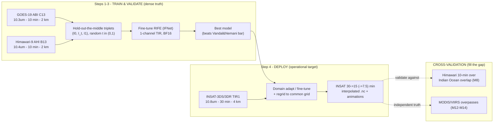

---

## 3. System Overview

FrameFlow is a pipeline of seven stages: **data sources → ingest → cube → ML → inference → precompute → CDN → web**. The defining principle (R3 §0) is a clean split between an **offline plane** (everything expensive and super-linear, done once) and an **online plane** (only O(1) edge lookups).

### 3.1 End-to-end architecture diagram

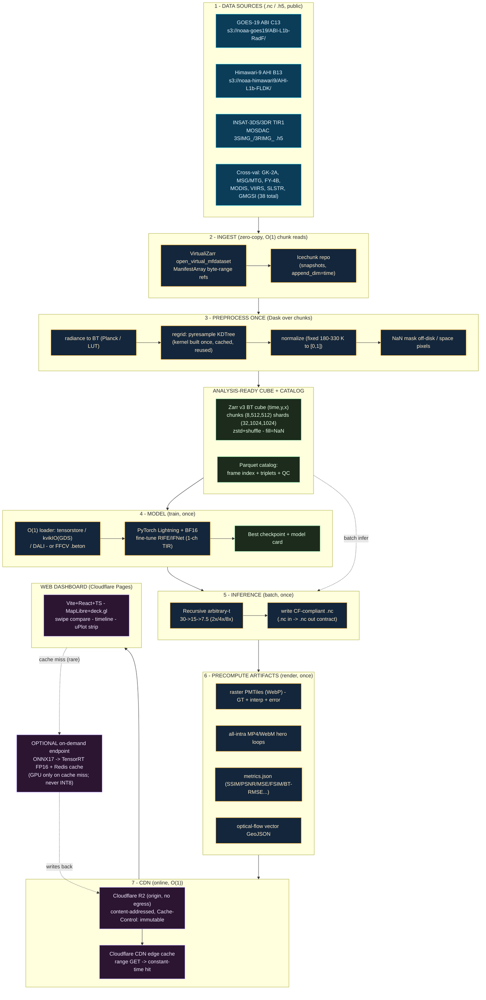

### 3.2 Written walkthrough

1. **Data sources (`.nc`/`.h5`).** All inputs are NetCDF4 or HDF5, satisfying the PS I/O rule (`idea.md` l. 20). Primary training data is pulled anonymously from `s3://noaa-goes19/ABI-L1b-RadF/` and `s3://noaa-himawari9/AHI-L1b-FLDK/`; the deployment target INSAT-3DS/3DR comes from MOSDAC (`3SIMG_*`/`3RIMG_*` HDF5) with an EUMETSAT mirror as redundancy (R2 §1, §2, §3).
2. **Ingest (zero-copy).** **VirtualiZarr** scans each file once and records every internal chunk's `(file, offset, length)`; these references are committed to an **Icechunk** repo. Reading a chunk is then *one HTTP range GET into the untouched original file* — no copy, no translation, address precomputed → O(1) (R3 §1.2–1.3). New frames append in O(1) metadata work (`append_dim="time"`).
3. **Preprocess once.** Dask maps over chunks: convert radiance → **brightness temperature** (ABI Planck coefficients `planck_fk1/fk2/bc1/bc2`, or INSAT count→radiance→BT LUT), **regrid** every sensor to a **common lat/lon grid** using a **pyresample KDTree kernel built once and cached** (the GEO grid never moves, so the mapping is identical every frame — gather, not rebuild), **normalize** to a fixed physical range, and **mask** off-disk/space pixels as NaN (R3 §4, §5).
4. **Analysis cube.** Results land in a **Zarr v3** cube, dims `(time, y, x)`, **chunks `(8,512,512)` float32**, **shards `(32,1024,1024)`**, `Blosc(zstd, clevel=5, shuffle)`, `fill_value=NaN`. A **Parquet catalog** indexes frames, training triplets, and QC flags. One chunk = one training window *or* one map tile (512 is a multiple of 256), so both access paths are O(1) (R3 §1.1, §2.1).
5. **Model (train once).** An O(1) loader (tensorstore / kvikIO GPUDirect / DALI, or a baked **FFCV `.beton`** if dataloader-bound) feeds **PyTorch Lightning + BF16** fine-tuning of RIFE/IFNet on single-channel TIR. Backbone transfers; only photometrics differ, so this is **hours on one GPU** (R6 §4).
6. **Inference (batch once).** The best model runs the **recursive arbitrary-`t`** scheduler (30→15→7.5) and writes **CF-compliant `.nc`** (the strict `.nc` in → `.nc` out contract, R6 §3, `idea.md` l. 35).
7. **Precompute artifacts.** Frames render once to **raster PMTiles (WebP)** for GT/interp/error, **all-intra MP4/WebM** hero loops, **`metrics.json`**, and **optical-flow vector GeoJSON** (R3 §6; R4 §8).
8. **CDN (online, O(1)).** Artifacts upload to **Cloudflare R2** (content-addressed, `Cache-Control: public, max-age=31536000, immutable`) behind the **Cloudflare CDN**. A frame seek is one `Range:` GET, edge-cached after first view (R3 §6.2; R4 §4).
9. **Web dashboard.** The **Vite+React+TS** SPA on **Cloudflare Pages** renders GT-vs-interpolated swipe-compare, a scrubbable timeline, the uPlot metric strip, and the flow-vector overlay — all reading static artifacts from the edge (R4 §8).
10. **Optional on-demand.** For "interpolate this new pair now," a **TensorRT FP16** endpoint behind a **Redis + CDN content-addressed cache** runs the GPU *only on a cache miss* and writes results back so the second request is O(1) (R6 §3.4).

---

## 4. Data Architecture

The data layer is the foundation of both scientific robustness (many independent sensors) and speed (everything addressable in O(1)). It is grounded in R2 (the 38-dataset catalogue) and R3 (the data-engineering stack).

### 4.1 Multi-satellite strategy — the 38 catalogued datasets

A single GEO satellite has a fixed viewing geometry (limb distortion), periodic outages, and one radiometric calibration. A model trained on one source can overfit its artefacts. We therefore use a **ring of geostationary satellites plus polar orbiters**: train on the densest feed, test transfer on every other GEO, and use overpasses as independent ground truth — directly satisfying the "30+ methods, broad cross-validation, fill the gaps" requirement (R2 §0, §11).

**Role-based summary of the 38 catalogued datasets/access-methods (R2 counts them M1…M38):**

| Role | Datasets (count) | Exact access | TIR channel | Why |
|---|---|---|---|---|
| **Primary training** | GOES-19/18 ABI (6 access methods) | `s3://noaa-goes19/ABI-L1b-RadF/` (anon S3), `ABI-L2-CMIPF` (BT-ready), `goes2go`, GCS mirror, MS Planetary Computer, GEE, NOAA CLASS | **C13 = 10.3 µm** (C14 11.2, C15 12.3) | Free, no-auth, 10-min full-disk, huge archive; C13 = closest ABI analog to INSAT TIR1 |
| **Secondary training** | Himawari-9/8 AHI (methods 7–10), GK-2A AMI (20–21) | `s3://noaa-himawari9/AHI-L1b-FLDK/`, JAXA P-Tree gridded NetCDF, `s3://noaa-gk2a-pds/` | **B13 = 10.4 µm**, **IR105 = 10.5 µm** | Different sensors/geometry → generalization; B13 ≈ INSAT TIR1; both 10-min |
| **Deployment target** | INSAT-3DS/3DR/3D Imager (methods 11–14) | MOSDAC `mdapi.py` (`3SIMG_L1B_STD`, `3RIMG_L1B_STD`), EUMETSAT `EO:EUM:DAT:INSAT:INSAT3D-L1C`, Bhuvan | **TIR1 = 10.8 µm** (TIR2 11.9) | The operational target of PS-12 |
| **GEO cross-val** | Meteosat MSG/MTG (15–17), FY-4A/B (18–19), Electro-L (22) | EUMETSAT `eumdac` (`EO:EUM:DAT:MSG:HRSEVIRI`, IODC), NSMC FengYun, Roscosmos | IR10.8 / IR10.5 / ~10.8 µm | Independent GEOs overlapping INSAT (esp. Meteosat-IODC 45.5°E, FY-4B 133°E, Electro-L 76°E) |
| **Polar-orbiter truth** | MODIS (23), VIIRS (24), SLSTR (25), AVHRR (26), IASI (27), Landsat TIRS (28), ECOSTRESS (29), GCOM-C (30) | LAADS, `s3://noaa-jpss`, MS Planetary Computer, `eumdac`, `s3://usgs-landsat`, LP DAAC, G-Portal | B31 11.0, M15 10.76, S8 10.85, ch4 10.8, B10 10.6–11.2 | Higher-spatial-res, independent radiometry at known overpass times |
| **Mosaics & infra** | GMGSI (31), AWS NODD (32), GEE (33), MS PC (34), Earthdata (35), Copernicus (36), kerchunk/Zarr (37), THREDDS/OPeNDAP (38) | `s3://noaa-gmgsi-pds` (`GMGSI_LW`), `s3://noaa-nodd-kerchunk` | LW IR blend | Globally-consistent reference; fast repeated access; gap-fill backbone |

**Total: 38 distinct datasets/access methods (≥30 required) (R2 §9).**

#### Cross-validation overlaps we exploit (R2 §11.1)

The world's GEO satellites form a ring; adjacent satellites overlap at their limbs, and polar orbiters cut across all of them:

| Overlap | Satellites & longitudes | Use |
|---|---|---|
| **Pacific** | GOES-West (137.2°W) ↔ Himawari-9 (140.7°E) | Same clouds from opposite sides → validate interpolated GOES frame vs Himawari after reprojection (independent sensor, same scene/time) (R5 M7) |
| **Indian Ocean** | INSAT (74–82°E) ↔ Himawari (140.7°E, E edge) | **Real 10-min truth for the 30-min INSAT deployment** — the key gap-fill (R5 M8) |
| **Indian domain triple** | INSAT (74°E) ↔ Meteosat-IODC (45.5°E) ↔ Electro-L (76°E) | Electro-L at 76°E ≈ co-located with INSAT-3DR → near-nadir independent IR check (R2 §11.1) |
| **Asian convection** | INSAT ↔ FY-4B (133°E) | Eastern overlap for Asian deep convection (R5 M9) |
| **Polar overpasses** | MODIS/VIIRS/SLSTR/Landsat/ECOSTRESS across all GEOs | Independent BT truth at overpass times — including *exactly at synthesized timestamps* (R5 M12–M14) |

**Harmonization before mixing sensors (R2 §11.4):** spectral (C13 10.3 ≈ B13 10.4 ≈ IR105 10.5 ≈ MSG 10.8 ≈ TIR1 10.8 ≈ MODIS B31 11.0 → small BT adjustment), radiometric (**GSICS** IASI/CrIS-anchored inter-cal; ABI–AHI agree within ~0.3 K — our error-budget floor), geometric (reproject all to a common grid with pyresample/satpy).

### 4.2 The canonical Zarr v3 brightness-temperature cube

The analysis-ready store is a single **Zarr v3** cube, designed so that *one chunk read* serves *either* a training window *or* a map tile (R3 §1.1, §2.1, §8.1).

```python
import zarr, numpy as np
from zarr.codecs import BloscCodec, BloscShuffle

z = zarr.create_array(
    store="s3://frameflow-cubes/goes19_tir_bt.zarr",
    shape=(N_time, 2816, 2816),            # (time, y, x) on a common lat/lon grid
    chunks=(8, 512, 512),                  # ~8 MB float32: a few frames x a 512^2 tile
    shards=(32, 1024, 1024),               # 4x2x2 = 16 chunks/shard -> few large objects
    dtype="float32",
    compressors=[BloscCodec(cname="zstd", clevel=5, shuffle=BloscShuffle.shuffle)],
    fill_value=np.nan,                     # off-disk / space pixels = NaN
)
# z[t0:t1, y0:y1, x0:x1] -> floor(index/chunk) arithmetic -> exactly the needed
# shard/chunk objects. Aligned read = ONE range GET = O(1).
```

**Schema rationale:**

| Property | Value | Why (R3) |
|---|---|---|
| **dims** | `(time, y, x)` | Natural for a time-series of 2-D BT fields; time is the interpolation axis |
| **chunks** | `(8, 512, 512)` (~8 MB float32) | Bundles a short temporal window with a spatial tile; serves VFI triplets *and* 256/512 map tiles; ≥1 MB for good Blosc throughput (§2.1) |
| **shards** | `(32, 1024, 1024)` (16 chunks/shard) | Sharding codec decouples chunk size from object count → small chunks without millions of tiny S3 objects; one inner-chunk read = one ranged GET into the shard footer index = O(1) (§1.1) |
| **codec** | `Blosc(zstd, clevel=5, shuffle)` | Best ratio/speed balance for smooth, correlated float fields; LZ4 variant for the GPU-decode (nvCOMP) path (§1.5) |
| **fill_value** | `NaN` | Geostationary full-disk has off-Earth pixels; VFI loss and metrics ignore NaN (§5.3) |
| **dtype** | `float32` | BT in Kelvin needs float; optional bit-rounding to 0.01 K before compression boosts ratio with negligible model impact (§1.5) |
| **grid** | common regional lat/lon `AreaDefinition` | Co-registers GOES, Himawari, INSAT pixel-for-pixel for training/transfer/cross-val (§4) |

A companion **boolean valid-mask** array (from the resample `valid_out`) and a **Parquet catalog** (frame timestamps, `(t−Δ, t, t+Δ)` triplets, per-frame stats, QC flags) accompany the cube (R3 §5.3, §5.4).

### 4.3 Zero-copy ingest: VirtualiZarr → Icechunk

Because the PS requires `.nc`/`.h5` I/O and the archives are already NetCDF4/HDF5, we never bulk-copy. **VirtualiZarr** builds an in-memory lookup table of byte-range references over the original files; **Icechunk** persists them transactionally with snapshots and append (R3 §1.2–1.3).

```python
from virtualizarr import open_virtual_mfdataset
from virtualizarr.parsers import HDFParser          # netCDF4 == HDF5
import icechunk

vds = open_virtual_mfdataset(goes_c13_urls, parser=HDFParser(), combine="by_coords",
                             loadable_variables=["t", "x", "y"])   # big data stays virtual
repo = icechunk.Repository.create(icechunk.s3_storage(bucket="frameflow", prefix="icechunk/goes19"))
s = repo.writable_session("main"); vds.vz.to_icechunk(s.store); s.commit("ingest GOES-19 C13")
# Later, append one timestep in O(1) metadata work:
s = repo.writable_session("main"); vds_next.vz.to_icechunk(s.store, append_dim="time"); s.commit("append frame")
```

- **Why O(1):** each NetCDF4/HDF5 file is internally chunked; VirtualiZarr records each chunk's `(offset, length, codec)` once, so a later read is a single direct range GET — no copy, no B-tree walk whose depth grows with N (R3 §1.2).
- **Reproducibility:** pin an Icechunk snapshot ID for each training run (R3 §1.3).
- **Portable alternative:** export kerchunk **parquet** references (faster to load than giant JSON) for environments without Icechunk (R3 §1.2). NOAA even publishes prebuilt references at `s3://noaa-nodd-kerchunk` (R2 §9 method 37).

### 4.4 Cached pyresample KDTree regridding (the per-frame O(1) trick)

GOES-19, INSAT-3DS, and Himawari sit on **GEOS fixed grids from different sub-satellite longitudes**. To co-register them (and to make a clean lat/lon cube), we regrid to a common target grid. Because the satellite and its grid **do not move**, the nearest-neighbour/bilinear mapping is **identical for every timestep** — so we build the KDTree neighbour indices + weights **once**, cache to disk, and every subsequent frame is a cheap **gather** (R3 §4):

```python
from pyresample import kd_tree
# Build neighbour info ONCE (the expensive KDTree step) for src(GEOS) -> tgt(common lat/lon):
valid_in, valid_out, idx, dist = kd_tree.get_neighbour_info(src, tgt, radius_of_influence=6000, neighbours=1)
np.savez("kernel_goes19_to_grid.npz", valid_in=valid_in, valid_out=valid_out, idx=idx)  # cache
def resample_frame(bt_2d):                                   # per-frame: gather only (reused N times)
    return kd_tree.get_sample_from_neighbour_info('nn', tgt.shape, bt_2d, valid_in, valid_out, idx)
```

satpy's `KDTreeResampler` with `cache_dir=` does this automatically and is explicitly documented as "most beneficial with geostationary satellite data where the locations of the source data and the target pixels don't change over time" (R3 §4). This turns per-frame regridding from O(N log N) into a near-O(N) gather with O(1) setup. To co-register INSAT with GOES, we resample **both** to the *same* `AreaDefinition`.

### 4.5 BT conversion & normalization

- **GOES-19 ABI:** use **L2 CMIP** `CMI` directly (Kelvin), or convert L1b radiance with the in-file Planck coefficients: `Tb = (planck_fk2 / ln(planck_fk1/Rad + 1) − planck_bc1) / planck_bc2` (R2 §A3; R3 §5.1).
- **INSAT-3DS/3DR TIR1:** L1C provides counts, radiance (via Quadratic/Gain/Offset coefficients), and BT; apply the count→radiance→BT LUT (`IMG_TIR1` + `IMG_TIR1_TEMP`) (R3 §5.1; R2 §3).
- **Normalization:** map a **fixed physical range [180 K, 330 K] → [0,1]** (reproducible across GOES/Himawari/INSAT, makes transfer cleaner), while **retaining raw Kelvin** to report BT-RMSE/MAE in K — more physically meaningful for TIR than PSNR (R1 §7.2; R3 §5.2). Normalization constants are stored in `zarr.json` attrs so inference is deterministic.
- **Do it once.** BT conversion, regridding, and normalization are all baked into the cube; training and serving never re-derive them (R3 §5.1).

### 4.6 Data-flow diagram

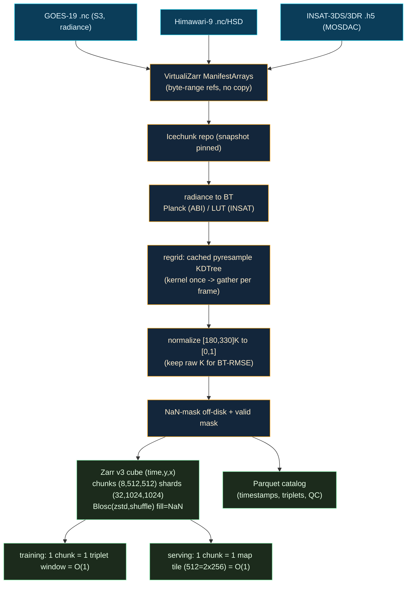

> **Precision on O(1) (R3 §8.7):** *O(1)* = Zarr/virtual chunk lookup (index arithmetic → 1 range GET), training-sample read (1 chunk), tile/clip serving (deterministic key → CDN edge hit), resample *application* (kernel preloaded). *NOT O(1)* (so done offline, once) = warp/regrid compute, radiance→BT, normalization stats, VFI inference, tile/clip rendering, KDTree *construction*. All amortised into the persisted artifacts.

---

## 5. Model Architecture

### 5.1 Primary engine: RIFE / Practical-RIFE (IFNet)

The primary deliverable model is **RIFE / Practical-RIFE v4.25–4.26**, whose core is **IFNet** (Intermediate Flow Network). It is the ranked #1 recommendation across four axes — speed, quality, license, fine-tunability — and the PS itself names RIFE (R1 §0, §3.2, §9).

| Axis | RIFE / Practical-RIFE | Why it wins for PS-12 |
|---|---|---|
| **Speed** | ~**10 ms @ 512²**; 30–60+ FPS @ 720p on one GPU; 4–27× faster than Super SloMo/DAIN | Meets "near real-time"; whole demo corpus precomputes in minutes (R6 §7) |
| **Flow mechanism** | IFNet directly estimates the **intermediate flow** (from `t` to both inputs) coarse-to-fine; **no external flow net** | Exactly the optical-flow-based interpolation the PS requires, and why it is fast (R1 §3.2) |
| **Arbitrary time** | Native `t ∈ (0,1)` via temporal encoding (v4.x built for any `t`) | 00:05/00:10/00:15 (`t`=0.25/0.5/0.75) and **30→15→7.5** come for free; recursion gives ×4/×8 (R1 §0) |
| **License** | **MIT** (verified on `hzwer/ECCV2022-RIFE` and `hzwer/Practical-RIFE`) | Clean for ISRO/government deployment and any commercialization (R1 §9) |
| **Size / fine-tune** | **~10 M params**, simple training code | Easiest model to retrain on single-channel BT; tiny stem → trivial 3→1 channel change (R1 §3.2) |

**Single-channel TIR adaptation (R1 §7.1; R6 §4.7).** TIR1/C13/B13 are single-channel brightness-temperature fields, not RGB. Two options, ablated:
1. **Replicate 1→3 channels** (cheapest; reuse RGB-pretrained weights verbatim) — the zero-surgery starting point.
2. **Edit the first conv to `in_channels=1`** and initialize by **averaging the pretrained RGB filters** into a 1-channel kernel, then fine-tune — cleaner and slightly better.

Per Vandal & Nemani, **per-channel (single-channel) training is the right design** — you do not need RGB, and task-specific fine-tuning beats generic weights (R1 §1).

### 5.2 The comparator zoo (the PS requires comparison)

The PS asks us to *explore models* and pick the *best* (`idea.md` ll. 26, 45). We benchmark a deliberate ladder so the "best model" claim is earned (R1 §3.1, §8):

| Role | Model | Venue / License | Vimeo90K PSNR | Arbitrary `t`? | Why included |
|---|---|---|---|---|---|
| **PRIMARY** | **RIFE / Practical-RIFE v4.x** | ECCV'22 / **MIT** | ~35.6 (v3.x); higher v4.x | **Yes** | Speed/quality/license/fine-tune balance; PS-named |
| Quality challenger #1 | **EMA-VFI** | CVPR'23 / **Apache-2.0** | **36.64** (base) | **Yes** | Top accuracy, CNN+Transformer; small/base speed↔quality dial |
| Quality challenger #2 (large motion) | **GIMM-VFI** | NeurIPS'24 | high | **Yes (native)** | SOTA on large-motion/arbitrary-time (X-Test, SNU-FILM-arb); implicit motion on RAFT/FlowFormer — best for fast cyclone bands |
| Efficient alt | **IFRNet / IFRNet-S** | CVPR'22 / **MIT** | ~35.8 (L) / 35.59 (S) | Yes | Best quality/latency/param trade-off; flow distillation built in (R6 §0) |
| **Named baseline / closest prior art** | **Super SloMo** (task-specific GOES variant) | CVPR'18 | ~34.0 | **Yes** | PS-named; the Vandal & Nemani basis — the apples-to-apples scientific baseline |
| Large-motion comparator | **FILM** | ECCV'22 / **Apache-2.0** | strong | No (t=0.5; recurse) | Google large-motion specialist; Gram/style loss |
| Frontier (optional) | **VFIMamba / BiM-VFI** | NeurIPS'24 / CVPR'25 | 36.64 / high | Yes | Linear-complexity SSM; non-uniform motion (cloud accel/decel) |
| **Classical baseline** | **Farnebäck / TV-L1 + linear blend** | OpenCV | — | n/a | The "traditional optical flow" the PS says *fails* — we must beat it |
| Trivial baselines | persistence (frame-copy), linear blend | — | — | n/a | Floor every method must clear (R5 M18–M19) |
| Perceptual upper bound (optional) | **MoMo** (flow-diffusion) | AAAI'25 | high perceptual | Yes | Diffuses *flow* then warps real pixels → stays physical; perceptual ceiling only |

**Explicitly avoided as primary (R1 §3.2, §5):** kernel-only methods (SepConv, CAIN) and flow-agnostic ones (FLAVR) do not cleanly satisfy "based on optical flow" and handle large cloud motion worse; **diffusion VFI** (LDMVFI, VIDIM) is slow and can **hallucinate plausible-but-wrong cloud structure** — unacceptable as the deliverable for a measurement product judged on MSE/PSNR/SSIM. Diffusion appears only as a perceptual upper-bound comparator, never shipped.

### 5.3 Optical-flow backbones (large motion + flow visualization)

RIFE/EMA-VFI/IFRNet estimate flow **internally** and need no external net. We need an explicit flow estimator only for (a) the **GIMM-VFI** comparator and (b) the **motion-vector overlay** on the dashboard and the **EPE** validation (R1 §4):

| Estimator | Strength | Speed | Use in FrameFlow |
|---|---|---|---|
| **RAFT** | Robust iterative refinement; handles non-rigid motion | Moderate | Default for flow-vector viz + EPE pseudo-reference (R5 M10) |
| **SEA-RAFT** | RAFT accuracy, ≥2.3× faster, SOTA on Spring | Fast | Near-real-time flow path (ECCV'24 Oral) |
| **GMFlow** | Best on very large displacement (global matching) | Slower | Reserved for fast cyclone bands |
| **FlowFormer/++** | Highest accuracy | Very slow | GIMM-VFI-F backbone; quality ceiling only |

### 5.4 The scientific quality bar (Vandal & Nemani 2021)

The single most important domain insight (R1 §1): **this exact problem has been solved in the literature**, and it tells us what works. Vandal & Nemani adapted **Super SloMo** (two U-Nets: optical flow + interpolation/visibility, trained end-to-end) to **GOES-R ABI**, one channel at a time, with per-channel BT standardization and random intermediate labels 10 min apart. On **Band 13 — exactly our channel** — at `t`=0.5, 10-min gap:

| Metric | Linear baseline | **SSM-T (task-specific)** | Improvement |
|---|---|---|---|
| **PSNR** | 38.667 | **45.439** | **+6.8 dB** |
| **RMSE** | 2.286 K | **0.991 K** | sub-Kelvin |
| **SSIM** | 0.782 | **0.933** | +0.151 |

This is our **citable, realistic target/bar to beat**, and it justifies five concrete design choices we adopt: single-channel training, BT standardization (keep raw Kelvin for RMSE), fine-tune (don't just run pretrained), report linear + classical-OF baselines, and target sub-Kelvin RMSE / SSIM ≥ 0.93 on C13 (R1 §1). We modernize the backbone (Super SloMo → RIFE) while keeping the satellite-specific recipe, and keep Super SloMo as a named baseline.

### 5.5 IFNet forward pass + recursive temporal upsampling

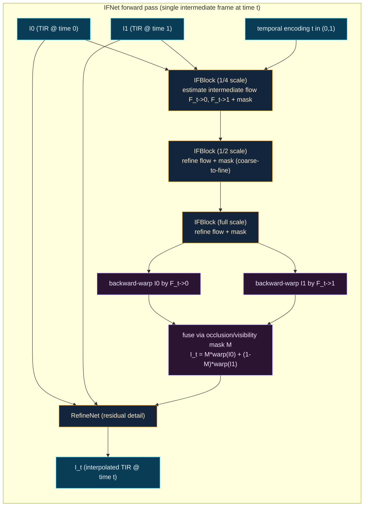

The recursive scheduler turns single-frame interpolation into arbitrary temporal upsampling. The PS's "30→15→7.5 min" is `2×` then `4×`; we also support `8×` for stress tests (R5 M3) and **direct arbitrary-`t`** (preferred — fewer recursion artefacts, R5 M4):

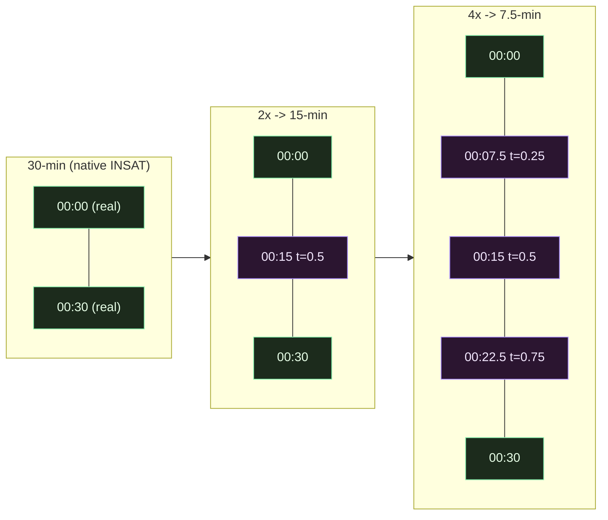

> **Risk & mitigation (R1 §9):** RIFE may blur very fast/non-linear convective growth. We mitigate by (a) fine-tuning on satellite data (proven to help), (b) arbitrary-`t` multi-scale flow, and (c) reporting GIMM-VFI/BiM-VFI on the hardest cyclone/convection cases. If a heavy model materially wins there, we ship a **two-tier system**: fast RIFE default + heavy model for severe events.

---

## 6. Training Strategy

The entire strategy follows from one fact (R6 §0): RIFE/IFRNet were trained **300 epochs on Vimeo90K with 4 GPUs** (days of compute), but the optical-flow/warping backbone *transfers* — only TIR photometrics differ. So we **fine-tune from pretrained weights for 20–40 epochs**, which converges in **hours on a single GPU**.

### 6.1 Fine-tune-from-pretrained (two-stage)

| Stage | Epochs | What | LR | Source |
|---|---|---|---|---|
| **0. Channel adaptation** | — | Replicate 1→3 (or avg-init conv1 to 1-ch) | — | R6 §4.7 |
| **1. Warm-up** | 2–5 | Freeze flow encoder, train synthesis/refine head on TIR | 1e-4 | R6 §4.7 |
| **2. Full fine-tune** | 15–30 | Unfreeze all, cosine LR, full loss | 1e-4 → 1e-5 | R6 §4.7 |

### 6.2 Framework, precision, resolution

- **PyTorch Lightning / Lightning Fabric** wraps the *existing* RIFE/IFRNet `nn.Module` — we keep their model and warp code, Lightning handles AMP/DDP/checkpointing/logging/determinism (R6 §4.1).
- **BF16 mixed** (`bf16-mixed`) on Ampere+ (A100/A10/L4/RTX 30/40 — no loss scaling); FP16-mixed + `GradScaler` on T4/V100. ~2× throughput, ~40–50% memory cut (R6 §0, §4.2). Plus `torch.compile` (~1.3× train) and `channels_last` (~1.2× on Tensor Cores).
- **Resolution ladder:** start at **256×256 patches** (matches RIFE/IFRNet's native crop), move to **512×512** once stable (R6 §0). Sizing on a 16–24 GB GPU (R6 §7):

| Patch | Batch on 16 GB (T4/V100) | Batch on 24 GB (4090/A10/L4) |
|---|---|---|
| 256×256 | 16–24 | 32–48 |
| 512×512 | 4–8 | 8–16 |

  If 512² won't fit at batch ≥ 4, enable **gradient checkpointing** and/or **grad accumulation**. VFI models are tiny (3–20 M params) → **no FSDP needed**; use DDP for 2×T4 (R6 §4.3, §7).

### 6.3 Killing the data bottleneck (offline TIR-extraction ETL)

Per-step `.nc`/`.h5` decode starves the GPU (R6 §4.4). The fix is an **offline ETL once**: read all `.nc`/`.h5`, extract the TIR channel, normalize, cut overlapping `(prev, mid_gt, next)` triplets, and store as **WebDataset `.tar` shards** (pragmatic, cloud/Kaggle-friendly) or **FFCV `.beton`** (throughput king — beats DataLoader/WebDataset/DALI per CVPR'23). Training then streams shards with many workers; optional **NVIDIA DALI** for GPU-side augmentation. Triplet indices are precomputed in the Parquet catalog (R3 §5.4).

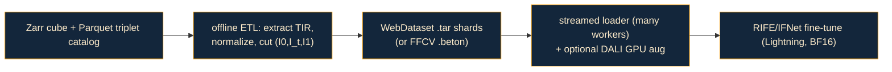

### 6.4 Loss function

The graders use MSE/PSNR/SSIM/FSIM, so we optimize fidelity + structure directly and avoid the RGB-perceptual domain trap (R6 §5.3):

```text
L = 1.0  * Charbonnier(I_hat, I_gt)        # robust L1 reconstruction core (eps=1e-3)
  + 0.5  * Census(I_hat, I_gt)             # ternary/structural -> illumination-robust, KEY for clouds
  + 0.25 * (1 - MS_SSIM(I_hat, I_gt))      # aligns with the SSIM family eval metrics
  + 0.1  * Gradient(I_hat, I_gt)           # sharp cloud edges (helps FSIM)
  + 0.01 * FlowDistillation + 0.01 * GeometryConsistency   # IFRNet/RIFE privileged losses (keep when fine-tuning them)
# OMIT VGG/LPIPS initially: VGG is ImageNet-RGB -> domain-mismatched on 1-channel TIR.
```

- **Why Charbonnier + Census:** Charbonnier is a stable robust-L1 default; Census (ternary) is robust to the photometric/illumination variation of clouds — *excellent for brightness-temperature fields* (R6 §5.1).
- **Why MS-SSIM + gradient:** they directly track the eval metrics and preserve the cloud-edge detail FSIM rewards (R6 §5.3).
- **Why skip VGG/LPIPS:** VGG/LPIPS/FILM-Gram are trained on **ImageNet RGB**; on single-channel TIR they require 1→3 replication and carry domain mismatch. We add LPIPS *only later* as a secondary ablation (0.05 weight) and report it as a secondary vote, never the verdict (R6 §5.1, §5.3; R5 §0).
- **Flow distillation / geometry consistency:** IFRNet's privileged losses (`λ=η=0.01`) sharpen output and speed convergence; we keep them when fine-tuning IFRNet/RIFE (R6 §5.2).

### 6.5 Time-based split (no leakage) + GPU targets + budget

- **Split by time/date, never randomly** — withheld frames *and their temporal neighbors* must not appear in training, or adjacent timesteps leak across the split (R6 §6, §9; R5 §7). Stratify by event and date.
- **GPU targets (R6 §4.5):** free = **Kaggle T4×2** (DDP) or Colab L4; cheap paid = **RunPod/Vast.ai** RTX 4090/A10/L4 (~$0.2–0.6/hr); managed serverless = **Modal** (per-second, sub-1 s cold start).
- **Budget (R6 §4.6):** fine-tune ~20–40 epochs over tens of thousands of triplets ≈ **6–20 GPU-hours** — a few hours on one 4090/A10, or two Kaggle T4×2 sessions. (RIFE's own README reports fine-tuning "another 20 epochs" on ~11 k frames — small budgets work.)

---

## 7. Inference & O(1) Serving

### 7.1 Recursive arbitrary-`t` interpolation

Inference uses the IFNet forward pass (§5.5) under a scheduler that produces any cadence. For **direct arbitrary-`t`** (preferred), we query `t = k/N` for the desired insert points in a single pass each — fewer compounding artefacts than recursive halving (R5 M4). For factors that are powers of two we also support **recursive 2×/4×/8×**. The PS demo (00:00 + 00:20 → 00:10) is `t=0.5`; the INSAT deliverable is 30→15 (`t=0.5`) then 30→7.5 (`t=0.25, 0.5, 0.75`) (`idea.md` ll. 45–46; R5 M3).

### 7.2 The NetCDF (`.nc`) I/O contract

The PS is explicit: **input and output files to the model must be `.nc`** (`idea.md` l. 35). The inference wrapper:

1. Reads the bracketing frames (C13/TIR1) from `.nc`/`.h5` via xarray/h5py.
2. Converts to BT and normalizes with the **stored** constants (deterministic).
3. Runs the model at the requested `t` value(s).
4. Denormalizes back to **Kelvin**.
5. Writes a **CF-conventions-compliant `.nc`** with proper coordinates (lat/lon, time), the BT variable, units (`K`), the interpolation `t`, `model_version`, source-frame provenance, and a `synthetic=true` flag (R1 §7.6; R6 §3.1). Internal chunking is set (`chunksizes=(1, 512, 512)`) so downstream virtual access stays coarse-grained and fast (R3 §1.4).

### 7.3 The hybrid serving design (the heart of O(1))

On-demand GPU inference is O(model FLOPs) + cold start + GPU cost per request. But every interpolated frame is **deterministic** given `(frameA, frameB, t, model)`. So we compute them **once, offline**, and serve static artifacts; per-request work collapses to a **CDN edge fetch = O(1)** with zero origin compute and zero GPU (R6 §3.1; R3 §6).

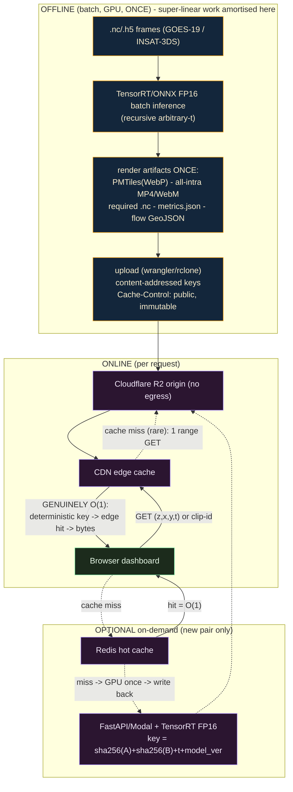

**Where it is genuinely O(1) (R3 §8.7; R6 §3):** the labelled edge of the diagram — `GET (z,x,y,t)` or `clip-id` → deterministic content-addressed key → CDN edge cache hit → constant-time bytes. No model, no GDAL, no DB scan on the request path. The first view fills the edge; every subsequent read (and every other user) is a constant-time hit because `Cache-Control: immutable` on content-addressed URLs "nullifies the need for browsers to perform conditional revalidation" (R3 §6.2).

### 7.4 Artifact types (R3 §6.1; R4 §3)

| Artifact | Format | Purpose | O(1) mechanism |
|---|---|---|---|
| **Scrub / pan-zoom** | raster **PMTiles** (WebP) — one per dataset (`gt`, `interp`, `error`) | Precision frame seek + map navigation | `(z,x,y)` → byte range in single archive → range GET, edge-cached |
| **Hero playback** | **all-intra MP4/WebM** (H.264/VP9/AV1) | Cinematic smooth loop | Every frame a keyframe → exact O(1) seek; range-served from R2 |
| **Metrics** | `metrics.json` | Per-frame SSIM/PSNR/MSE/FSIM/BT-RMSE for the chart strip | Single small JSON, optionally in Workers KV (0.5–10 ms) |
| **Flow overlay** | GeoJSON vectors | Optical-flow motion arrows | Static file |
| **Required output** | CF-compliant `.nc` | The PS deliverable | Object store |

**Why all-intra (R4 §2):** inter-frame (delta) frames depend on the previous keyframe, so seeking would require decoding from the nearest keyframe. Time-lapses are short (dozens–hundreds of frames), so **encoding every frame as a keyframe is cheap and makes every frame an O(1) seek target** for WebCodecs.

### 7.5 Optional on-demand endpoint (TensorRT FP16)

For "interpolate this new pair now," export **PyTorch → ONNX (opset 17) → TensorRT FP16** and serve via FastAPI+GPU (simplest) or Modal (serverless), behind a **Redis + CDN content-addressed cache** (R6 §1.2, §3.4):

- **Key:** `sha256(frameA) || sha256(frameB) || t || model_version` — deterministic, so the same inputs always hit; new `model_version` → new keys → no stale reads (R6 §3.3).
- **GPU runs only on a cache miss**, then writes the result into the cache so the *second* request is O(1).
- **grid_sample export (R6 §1.3):** RIFE/IFRNet use `F.grid_sample`; **2D grid_sample is supported in ONNX opset ≥ 16** and **TensorRT ≥ 8.5/8.6 imports 2D `GridSample` natively**. Export with `opset_version=17`, build with `trtexec --fp16`.
- **Speed (R6 §1.1):** TensorRT FP16 gives +40–100% vs ncnn/Vulkan; RIFE already runs 30+ FPS @ 720p on a 2080Ti.

### 7.6 INT8 must be avoided for VFI

**This is a hard rule.** Naive INT8 PTQ collapses VFI quality — the ANVIL study measured **−0.89 dB (RIFE flow)** up to **−4.38 dB (IFRNet frame mode)** — catastrophic for a task graded on PSNR/SSIM (R6 §0, §1.4). We use **FP16/BF16 only**. INT8 would be considered solely with full **QAT** (costing a training run) if edge/CPU deployment ever made it mandatory; for this challenge the cost/benefit says stay FP16.

---

## 8. Validation & Scientific Robustness

The PS asks for SSIM/MSE/PSNR/FSIM "and any other suitable metrics… suitable to capture the cloud movements" (`idea.md` ll. 41–42). We go far beyond the literal ask because **pixel metrics alone are necessary but not sufficient**: in the VFI literature, PSNR/SSIM/LPIPS "do not provide satisfactory correlation with perceptual quality" — they over-penalize physically-plausible motion (a 1-px cloud shift dominates MSE) and under-penalize subtle blur (R5 §1). This is the scientific justification for a multi-layer, multi-method approach.

### 8.1 The 4-layer metric suite

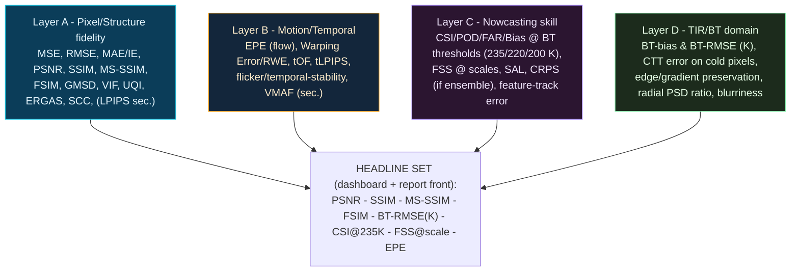

| Layer | What it captures | Key metrics | Libraries (R5 §1–3) |
|---|---|---|---|
| **A — Pixel/Structure** | Per-frame fidelity vs withheld GT | MSE, RMSE, MAE/IE, **PSNR, SSIM, MS-SSIM, FSIM**, GMSD, VIF, UQI, ERGAS, SCC; LPIPS (secondary) | scikit-image, sewar, **piq**, torchmetrics, lpips |
| **B — Motion/Temporal** | "Cloud movement" the PS asks for | **EPE** (RAFT pseudo-ref), Warping Error / RWE, tOF, tLPIPS, flicker, VMAF (secondary) | torchvision RAFT, OpenCV, lpips, ffmpeg-libvmaf |
| **C — Nowcasting skill** | Cold-cloud "events" placed correctly | **CSI/POD/FAR/Bias @ 235/220/200 K**, **FSS @ 1/3/9/27/81 px**, SAL, CRPS (if ensemble), feature-track error | **pysteps**, xskillscore, tobac |
| **D — TIR/BT domain** | Physical correctness in Kelvin | **BT-bias & BT-RMSE (K)**, CTT error on cold pixels, edge/gradient preservation, **radial PSD ratio**, blurriness (var-of-Laplacian) | scipy, numpy.fft, pywt, skimage |

**Convention (R5 §1):** compute pixel metrics on *both* physical BT in Kelvin (MSE/RMSE/MAE/PSNR with explicit `data_range` = 150 K span) *and* normalized [0,1] (SSIM-family). **Always state `data_range`** — SSIM/PSNR are meaningless without it; silent default mismatch is the #1 source of bogus numbers. **Judge K-errors against the ~0.3 K ABI–AHI inter-sensor floor and ~1–2 K sounding accuracy** — within a few K is excellent (R5 §3.6).

### 8.2 The 40-method cross-validation framework

The mandate: *use broad multi-satellite data to verify results and fill each dataset's gaps; ≥30 distinct methods.* Below are **40 concrete, independently-runnable methods** (R5 §4, M1…M40), grouped. Together they triangulate truth from many directions so each dataset's weakness (GOES geography, INSAT cadence, LEO sparsity) is covered by another's strength.

**A. Withheld-ground-truth interpolation tests (exact-match)**
1. **M1** — Leave-the-middle-frame-out on dense GOES-19 (PRIMARY): 00:00 + 00:20 → predict 00:10, real frame withheld; full Layer A/B/C/D suite.
2. **M2** — Leave-the-middle-out on Himawari (independent dense source, fills GOES's Asia/India gap).
3. **M3** — Multi-step recursion vs direct: 30→15 (1), 30→7.5 (3), 30→3.75 (7) frames held out.
4. **M4** — Recursion-depth / error-accumulation: recursive halving vs single-shot multi-frame.
5. **M5** — Asymmetric-interval: predict off-center times (00:05, 00:15) using GOES 5-/1-min truth.
6. **M6** — Long-gap stress: 60-min-apart inputs predict the 3 intervening real 15-min frames (simulates INSAT cadence).

**B. Cross-satellite verification (multi-satellite, fills geographic/temporal gaps)**
7. **M7** — GOES + Himawari Pacific overlap: interpolate one, validate against the other's near-simultaneous frame (after GSICS + reprojection).
8. **M8** — **INSAT + Himawari Indian-Ocean overlap**: validate INSAT interpolation against Himawari's real 10-min frames — *the key "fill-the-gap" check for the INSAT deliverable*.
9. **M9** — INSAT vs GOES / three-way scene where geometry allows.
10. **M10** — Cross-satellite consistency of *derived motion* (flow from GOES vs Himawari over overlap).
11. **M11** — GSICS inter-calibration as pre-step + sanity check (the ~0.3 K bias is a built-in reference floor).

**C. Independent polar-orbiter "truth at a time" overpasses**
12. **M12** — MODIS (Terra/Aqua) B31 (~11 µm) overpass collocation.
13. **M13** — VIIRS (SNPP/NOAA-20/21) M15/I5 overpass collocation (more overpasses, fills MODIS gaps).
14. **M14** — Polar-orbiter as truth specifically at *interpolated* timestamps (strongest independent check of a synthetic frame).

**D. Statistical triangulation**
15. **M15** — **Triple collocation (TC)**: from three independent estimates (interpolated-GOES, real-Himawari, polar-orbiter) estimate each one's *random error variance* without assuming any is perfect → an *absolute* error bar on the interpolation.
16. **M16** — N-way / quadruple collocation (add NWP or a 2nd LEO to relax TC assumptions).
17. **M17** — Error-variance budget check (TC error consistent across regions/seasons).

**E. Baseline & method comparisons (is the AI actually helping?)**
18. **M18** — Naive frame-copy (persistence) baseline.
19. **M19** — Linear-blend baseline (ghosting; must be beaten on FSIM/PSD/blur).
20. **M20** — Classical optical-flow baselines (Farnebäck & TV-L1 warp) — the "traditional optical flow" the PS says fails.
21. **M21** — DL VFI backbones head-to-head: RIFE vs Super SloMo vs EMA-VFI/FILM/IFRNet/GIMM-VFI → ranked table → pick the "best model".
22. **M22** — Ablation: with vs without explicit optical flow (does the flow module help?).
23. **M23** — Ablation: flow backbone swap (RAFT vs PWC-Net vs TV-L1).
24. **M24** — Ablation: loss / warping (forward vs backward warp, with/without refine net, with/without perceptual loss).
25. **M25** — Ablation: input normalization / radiometric pre-processing (K vs DN, with/without histogram norm).

**F. Stratified / conditional evaluation (where does it work / fail?)**
26. **M26** — Extreme-motion stratification (cyclones / deep convection) by flow magnitude.
27. **M27** — Phenomenon stratification: cyclone vs thunderstorm vs fire vs flood vs clear (the PS-named phenomena).
28. **M28** — Per-region stratification (tropics vs mid-lat, land vs ocean, Indian subcontinent vs Pacific).
29. **M29** — Per-season / diurnal stratification (monsoon vs dry; day vs night — TIR works at night, verify no diurnal bias).
30. **M30** — Cloud-regime stratification by BT bands (warm/clear, mid, cold convective).

**G. Correlation, spectral & significance analyses**
31. **M31** — Error-vs-cloud-speed correlation (regress RMSE/SSIM/EPE on cloud speed; report R²).
32. **M32** — Error-vs-lead-fraction / vs up-sampling-factor (t=0.5 hardest; 2×/4×/8×).
33. **M33** — Fourier/spectral fidelity: **radially-averaged PSD ratio** (the single most diagnostic "did we keep fine scales?" metric) as a cross-method comparison.
34. **M34** — Wavelet multi-resolution fidelity (2-D DWT sub-band energy, `pywt`).
35. **M35** — Statistical-significance: paired **Wilcoxon / t-test** on per-frame metric deltas + **bootstrap 95% CIs**, with Holm/Benjamini–Hochberg correction across metrics.
36. **M36** — Inter-metric agreement: Spearman/Kendall correlation *between metrics* — when 14 metrics agree, that's a "collaborated robust finding".

**H. Physical-consistency & implementation cross-checks**
37. **M37** — Multi-band consistency (interpolate TIR1 + TIR2/WV; check split-window BT difference, WV–IR relationship via SAM/correlation).
38. **M38** — Mass/feature conservation: total cold-cloud area + domain-mean BT evolve smoothly through inserted frames (flag non-physical cloud creation/destruction).
39. **M39** — Temporal-consistency at the seams (discontinuities at real↔inserted frame boundaries).
40. **M40** — **Dual-implementation metric verification** (every metric by two libraries, asserted equal: skimage vs piq vs torchmetrics vs sewar) + fixed seeds + hashed data manifest.

> **40 distinct methods (≥30 required).** Minimum-viable-robust subset if time-constrained (R5 §4): M1, M2, M3/M4, M7, M8, M12/M13, M15, M18–M22, M26–M30, M31, M33, M35–M36 — already ~22 across every category.

**How broad data fills the gaps (R5 §4 close):** GOES-19 = dense exact-match truth but weak over India; **Himawari = a second dense source that overlaps INSAT over the Indian Ocean, supplying the real higher-cadence truth INSAT itself lacks (M8)**; INSAT = deployment target trusted via M8/M9; MODIS/VIIRS = instantaneous independent truth anywhere, including at synthesized timestamps (M12–M14); triple collocation (M15) turns these three views into absolute uncertainty estimates. Each weakness is covered by another's strength → genuinely collaborated, robust validation.

### 8.3 Report, plots & uncertainty quantification

The PS requires a report comparing results with ground truth, including plots (`idea.md` ll. 40–42). Structure (R5 §5):

- **Headline scorecard:** PSNR, SSIM, MS-SSIM, FSIM, BT-RMSE(K), CSI@235K, FSS@~50km, EPE for AI vs each baseline, with **bootstrap 95% CIs** and significance stars.
- **Metric-vs-time line plots** (diurnal/seasonal trends; monsoon/convective dips), AI vs baselines.
- **Error maps:** per-case (pred − truth) in K, |error|, SSIM-map / GMSD-map — reveals *where* errors concentrate.
- **Aggregate spatial heatmaps:** mean error / SSIM per grid cell → systematic geographic bias (ties to M28).
- **Distribution plots:** per-frame metric violins; BT histogram overlays with KS/Wasserstein annotated (M25).
- **Motion diagnostics:** flow quiver overlays, EPE maps, error-vs-cloud-speed scatter (M31), PSD-ratio curves + DWT bars (M33/M34).
- **Nowcasting panels:** FSS-vs-scale curves, performance/Roebber diagram, SAL S–A–L scatter.
- **Case studies (the persuasive core):** ≥3 events — a **cyclone** (extreme motion), **deep convection/thunderstorm**, and a **fire or flood** — side-by-side GT vs interpolated vs baseline film-strips + per-case tables/error maps (PS-named phenomena).
- **Uncertainty quantification (R5 §5.9):** (a) bootstrap CIs on every aggregate; (b) **triple-collocation error bars** (M15) as the headline absolute uncertainty; (c) ablation sensitivity bands; (d) explicit statement of the **~0.3 K inter-cal / ~1–2 K sounding floor** as the reference against which interpolation error is judged.
- **Reproducibility appendix:** library versions, `data_range` per metric, exact thresholds (BT bins, FSS scales), data-manifest hashes, seeds, and the dual-implementation agreement table (M40).

---

## 9. Web Dashboard Architecture

This is PS Deliverable D2 — the dashboard showing *original vs interpolated satellite animations* (time-lapse for both), a scrubbable timeline, and SSIM/MSE/PSNR/FSIM plots — judged on "Web GUI Design" and "Visual Quality of the INSAT-3DS interpolation images" (`idea.md` ll. 36–42, 54–55). The stack is the documented performance leader for animated raster over a map, and is fully open-source with O(1) frame seek (R4 §0).

### 9.1 Stack at a glance

| Concern | Choice | Why (R4) |
|---|---|---|
| App framework | **Vite + React + TypeScript** | Pure client-side SPA over *static* artifacts; fastest HMR, richest geospatial ecosystem (deck.gl/react-map-gl); CRA is deprecated (§5) |
| Render engine | **MapLibre GL JS** (base + plumbing) **+ deck.gl** (`BitmapLayer`/`TileLayer`) | GPU raster animation at 60 fps; no Mapbox token; WebGL2 today, WebGPU-ready (§1) |
| Tile / frame serving | **raster PMTiles on Cloudflare R2** + CDN | Single-file archive; HTTP range request = **O(1) frame seek**; no tile server; free egress (§4) |
| Compare UX | **`@maplibre/maplibre-gl-compare`** swipe (synced pan/zoom) | Drag-to-wipe GT ↔ interpolated; instant "wow" (§7) |
| Timeline | one unified scrubbable control | Drives both panes + the metric cursor (§7) |
| Metric charts | **uPlot** | 3,600 pts @ 60 fps on ~10% CPU / 12 MB RAM — smallest/fastest (§6) |
| Hero playback | **WebCodecs** all-intra MP4/WebM | HW-decoded buttery loop; all-intra → exact O(1) seek (§2, §3) |
| Flow overlay | deck.gl `LineLayer`/`TripsLayer` | Optical-flow motion vectors — strong storytelling of the model (§7) |
| Styling/polish | **shadcn/ui + Tailwind + Framer Motion** | Dark mission-control theme, fast modern components (§7) |
| Deployment | **Cloudflare Pages** (+ R2 + optional Worker/KV) | Free CDN egress, sub-10 ms edge, range-friendly (§5) |

### 9.2 Why this is O(1) (the pitch line, R4 §9)

Every frame and tile is a **deterministic byte range inside a single immutable PMTiles file on an edge CDN**. Seeking to any time `t` is one constant-time `Range:` GET, cache-hit after first view — **no tile server, no database, no per-request compute** in the hot path. The scrub path is *provably* O(1) (range GET per frame); the play path is GPU-smooth (WebCodecs); both come off the same CDN.

### 9.3 Animation strategy (the pragmatic hybrid, R4 §3)

| Path | Mechanism | Smooth | O(1) seek | When |
|---|---|---|---|---|
| **Scrub / precision compare** | image frames from **PMTiles** → deck.gl `BitmapLayer` (preload ±2 neighbors) | ★★★★ | ★★★★★ true random access | The time-slider; perfect GT↔interp parity |
| **"Play" button** | HW-decoded **all-intra MP4/WebM** via WebCodecs `VideoDecoder` → `BitmapLayer` | ★★★★★ | ★★★★ (all-intra) | Cinematic hero loop |
| **Thumbnails / mini-loop** | WebGL2 **texture array** (`sampler2DArray`) | ★★★★★ | ★★★★★ | Bounded-frame previews |

Watch GPU VRAM: images are uncompressed on the GPU, so a full-res 100-frame loop can blow VRAM — prefer video decode for long loops, texture arrays only for short hero clips (R4 §2).

### 9.4 Must-have interactions (R4 §7)

1. **Side-by-side synced compare** — swipe handle (drag to wipe) with synced pan/zoom; toggle to true two-pane mode.
2. **Unified timeline** — play/pause/scrub/step (⏮⏭)/speed (0.5×–4×)/loop, driving both panes + the metric cursor; timestamp + **"interpolated" badge** on synthetic frames.
3. **Region selector** — preset AOIs (cyclone, fire, flood case studies); switching region swaps the PMTiles URL (still O(1)).
4. **Layer toggles** — Basemap / GT raster / Interpolated raster / **Error heatmap** (|GT−interp| as a colored BitmapLayer) / **Optical-flow vectors**.
5. **Metric HUD** — uPlot strip (SSIM/PSNR/MSE/FSIM) + live numeric readout for the current frame, with cursor synced to the timeline.
6. **Optional 3D globe tab** — CesiumJS / deck.gl `GlobeView` showing the INSAT disk with the time-lapse on the sphere (extra dazzle).

Visual polish: dark palette (#0a0e14 bg, cyan/amber accents), glassy panels, monospace telemetry, a perceptually-uniform IR colormap (turbo/IR) with a legend/colorbar, responsive collapse to stacked panes on narrow screens.

### 9.5 Component diagram

```mermaid
flowchart TB
  classDef edge fill:#2b1530,stroke:#a78bfa,color:#f3e8ff
  classDef comp fill:#13263b,stroke:#22d3ee,color:#e6f7ff
  classDef state fill:#1c2b1c,stroke:#86efac,color:#e7ffe7

  subgraph CF["Cloudflare R2 + CDN (immutable, content-addressed)"]
    P1["gt.pmtiles"]:::edge
    P2["interp.pmtiles"]:::edge
    P3["error.pmtiles"]:::edge
    V1["gt.mp4 / interp.mp4 (all-intra)"]:::edge
    MJ["metrics.json"]:::edge
    FG["flow_vectors.geojson"]:::edge
    BM["basemap.pmtiles (Protomaps dark)"]:::edge
  end

  subgraph APP["AppShell (Vite+React+TS, shadcn/Tailwind, Framer Motion) - Cloudflare Pages"]
    direction TB
    subgraph CD["CompareDeck (MapLibre + deck.gl)"]
      MB["MapLibre base (dark basemap)"]:::comp
      L1["BitmapLayer <- current GT frame"]:::comp
      L2["BitmapLayer <- current Interp frame"]:::comp
      L3["BitmapLayer <- error heatmap (toggle)"]:::comp
      L4["LineLayer <- optical-flow vectors (toggle)"]:::comp
      SW["maplibre-gl-compare swipe (synced pan/zoom)"]:::comp
    end
    TL["Timeline: play/pause/scrub/step/speed/loop"]:::comp
    MP["MetricPanel: uPlot SSIM/PSNR/MSE/FSIM + synced cursor"]:::comp
    LT["LayerToggles / RegionSelector / ColorbarLegend"]:::comp
    ST["State (Zustand): currentFrame, isPlaying, region, activeLayers"]:::state
  end

  BM --> MB
  P1 -->|"scrub: range GET (O(1))"| L1
  P2 -->|"scrub: range GET (O(1))"| L2
  P3 --> L3
  FG --> L4
  V1 -->|"play: WebCodecs VideoDecoder -> VideoFrame"| L1
  MJ --> MP
  TL --> ST
  ST --> L1 & L2 & MP
  SW --- L1 & L2
```

---

## 10. Repository / Monorepo Layout

FrameFlow is a monorepo: a Python package (`frameflow/`) for the science/ML pipeline and a React app (`web/`) for the dashboard, with shared configs, scripts, tests, and docs. The current repository contains only `idea.md` and `research/`; the tree below is the planned target.

```text
bah2026-ps12/
├── README.md                      # project overview, quickstart, `make demo`
├── ARCHITECTURE.md                # THIS document
├── idea.md                        # verbatim PS-12 problem statement
├── Makefile                       # `make demo` end-to-end chain (synthetic -> web)
├── pyproject.toml                 # frameflow package metadata + deps (uv/pip)
├── Dockerfile.train               # pinned CUDA/cuDNN/PyTorch/TensorRT (train)
├── Dockerfile.serve               # slim image (precompute + optional endpoint)
├── docker-compose.yml             # local stack (Redis, TiTiler fallback, MinIO)
│
├── research/                      # the six deep-research reports (grounding)
│   ├── 01_vfi_models.md … 06_inference_serving.md
│
├── configs/                       # Hydra/OmegaConf config tree
│   ├── config.yaml                # root defaults
│   ├── data/{goes19,himawari9,insat3ds}.yaml
│   ├── model/{rife,ema_vfi,gimm_vfi,ifrnet,superslomo,classical}.yaml
│   ├── train/{finetune,from_scratch,tiny_demo}.yaml
│   ├── loss/{charbonnier_census_msssim,ablation_*}.yaml
│   ├── infer/{recursive_2x,arbitrary_t,insat_deploy}.yaml
│   ├── validate/{full_40,minimum_viable}.yaml
│   └── serve/{precompute,ondemand_trt}.yaml
│
├── frameflow/                     # === the Python package ===
│   ├── __init__.py
│   ├── data/                      # ingest, cube, regrid, BT, loaders
│   │   ├── sources.py             # anon S3 / MOSDAC / eumdac fetchers (38 datasets)
│   │   ├── virtualize.py          # VirtualiZarr -> Icechunk zero-copy ingest
│   │   ├── cube.py                # Zarr v3 (8,512,512)/(32,1024,1024) writer/reader
│   │   ├── regrid.py              # cached pyresample KDTree kernels
│   │   ├── radiometry.py          # radiance->BT (Planck/LUT), normalization
│   │   ├── catalog.py             # Parquet frame/triplet/QC catalog
│   │   └── loaders.py             # tensorstore/DALI/FFCV/WebDataset triplet loaders
│   ├── models/                    # model definitions + registry
│   │   ├── rife/                  # IFNet (primary), vendored + 1-ch adaptation
│   │   ├── ema_vfi/ gimm_vfi/ ifrnet/ superslomo/   # comparators
│   │   ├── classical.py           # Farnebäck / TV-L1 + linear baselines
│   │   └── registry.py            # name -> model factory (Hydra-driven)
│   ├── flow/                      # optical-flow backbones + viz
│   │   ├── raft.py sea_raft.py gmflow.py
│   │   └── visualize.py           # flow -> GeoJSON vectors / quiver
│   ├── train/                     # training loop
│   │   ├── lightning_module.py    # wraps nn.Module; BF16; logging
│   │   ├── losses.py              # Charbonnier, Census, MS-SSIM, gradient, distill
│   │   └── splits.py              # time-based (no-leakage) splits
│   ├── infer/                     # inference + recursion + .nc I/O
│   │   ├── interpolate.py         # forward pass wrapper
│   │   ├── recurse.py             # 2x/4x/8x + arbitrary-t scheduler
│   │   ├── netcdf_io.py           # CF-compliant .nc in/out contract
│   │   └── export.py              # ONNX(opset17) -> TensorRT FP16
│   ├── validate/                  # the 4-layer suite + 40 methods
│   │   ├── metrics_a.py … metrics_d.py   # Layers A/B/C/D
│   │   ├── crossval.py            # M1..M40 orchestration
│   │   ├── collocation.py         # triple/N-way collocation (M15-M17)
│   │   ├── stats.py               # bootstrap CIs, Wilcoxon, inter-metric matrix
│   │   └── report.py              # scorecard + plots + REPORT.md generator
│   ├── serve/                     # O(1) serving
│   │   ├── precompute.py          # batch infer -> PMTiles/MP4/metrics/nc
│   │   ├── tiles.py               # rio-pmtiles raster pyramids (WebP)
│   │   ├── video.py               # ffmpeg all-intra MP4/WebM
│   │   ├── publish.py             # R2 upload, content-addressed, immutable
│   │   └── endpoint.py            # optional FastAPI/Modal + Redis cache
│   ├── viz/                       # colormaps, georeferencing for tiles
│   │   └── colormap.py            # IR/turbo perceptually-uniform ramps + legend
│   └── cli.py                     # `frameflow ingest|train|infer|validate|precompute`
│
├── web/                           # === the React dashboard ===
│   ├── package.json vite.config.ts tailwind.config.ts
│   ├── src/
│   │   ├── App.tsx
│   │   ├── components/{CompareDeck,Timeline,MetricPanel,LayerToggles,
│   │   │               RegionSelector,ColorbarLegend,GlobeTab}.tsx
│   │   ├── lib/{pmtiles.ts,webcodecs.ts,deckLayers.ts,metrics.ts}
│   │   └── store.ts               # Zustand state
│   ├── public/
│   └── wrangler.toml              # Cloudflare Pages + R2 + Worker config
│
├── scripts/                       # thin CLI entry points / one-offs
│   ├── make_synthetic.py          # synthetic advecting-blob data for `make demo`
│   ├── pull_goes19.py pull_insat.py
│   ├── build_kernels.py           # precompute regrid KDTree kernels
│   └── bench_oneshot.py           # latency/throughput benchmark
│
├── tests/                         # pytest
│   ├── test_netcdf_contract.py    # .nc in -> .nc out round-trips, CF compliance
│   ├── test_cube_schema.py        # chunk/shard/codec invariants
│   ├── test_metrics_dual.py       # M40 dual-implementation agreement
│   ├── test_recurse.py            # arbitrary-t / 2x/4x correctness
│   └── test_regrid_cache.py       # kernel-reuse determinism
│
├── notebooks/                     # exploratory (kept out of the hot path)
└── docs/                          # MkDocs site (model card, data card, API)
    ├── model_card.md data_card.md REPORT.md
```

**Module responsibilities:**

| Module | Responsibility |
|---|---|
| `frameflow.data` | Acquire (38 datasets), virtualize (VirtualiZarr→Icechunk), regrid (cached KDTree), convert BT, normalize, build the Zarr cube + Parquet catalog, and serve O(1) training triplets. |
| `frameflow.models` | Primary RIFE/IFNet (with 1-channel TIR adaptation) + the comparator zoo + classical baselines, behind a Hydra-driven registry. |
| `frameflow.flow` | Explicit optical-flow backbones (RAFT/SEA-RAFT/GMFlow) for GIMM-VFI, EPE pseudo-reference, and flow-vector visualization. |
| `frameflow.train` | Lightning module wrapping the vendored model code; BF16; the composite loss; time-based no-leakage splits; experiment logging. |
| `frameflow.infer` | Forward-pass wrapper, recursive/arbitrary-`t` scheduler, the strict CF-compliant `.nc` I/O contract, and ONNX→TensorRT export. |
| `frameflow.validate` | The 4-layer metric suite, the M1–M40 cross-validation orchestration, collocation, significance stats, and the report/plot generator. |
| `frameflow.serve` | Batch precompute → PMTiles/MP4/metrics/`.nc`; R2 publish (content-addressed, immutable); optional TensorRT endpoint + Redis cache. |
| `frameflow.viz` | Scientific colormaps, georeferencing, and colorbar/legend assets for tiles. |
| `web/` | The Vite+React+TS dashboard (MapLibre+deck.gl, swipe compare, timeline, uPlot, WebCodecs hero loop), deployed to Cloudflare Pages. |
| `configs/` | Hydra/OmegaConf tree — one YAML per experiment, CLI overrides, multirun sweeps. |

---

## 11. End-to-End Pipeline & Reproducibility

### 11.1 The `make demo` chain

A single command runs the whole system end-to-end on **synthetic data** (no network, no GPU required, no credentials) so a judge can reproduce the architecture in minutes. Each step is also independently invokable via the `frameflow` CLI with Hydra overrides.

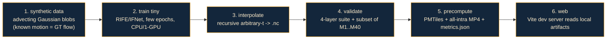

```makefile
demo: synthetic train-tiny interpolate validate precompute web    # one command, no network/GPU/creds
synthetic:   ; python scripts/make_synthetic.py --out data/synth      # known-motion blobs => GT flow for EPE
train-tiny:  ; frameflow train   train=tiny_demo data=synth model=rife
interpolate: ; frameflow infer   infer=arbitrary_t data=synth ckpt=runs/last.ckpt
validate:    ; frameflow validate validate=minimum_viable data=synth
precompute:  ; frameflow precompute serve=precompute data=synth out=web/public/demo
web:         ; cd web && npm install && npm run dev
```

Why synthetic blobs: their motion field is **known analytically**, so the demo can compute true EPE/warping error without external truth, and the whole loop runs on a laptop — de-risking the live demo (R6 §9: "precompute is the demo path; no cold starts during judging").

### 11.2 Hydra configs

One YAML per experiment with CLI overrides and `--multirun` sweeps (R6 §6). Examples:
```bash
frameflow train   model=rife data=goes19 train=finetune loss=charbonnier_census_msssim
frameflow train   --multirun model=rife,ema_vfi,ifrnet data=goes19   # comparator sweep -> M21 table
frameflow infer   infer=insat_deploy data=insat3ds ckpt=runs/best_ssim.ckpt
frameflow validate validate=full_40 data=goes19,himawari9
```

### 11.3 Docker, experiment tracking, model card

- **Docker (R6 §6):** `Dockerfile.train` pins CUDA/cuDNN/PyTorch/TensorRT for reproducible training; `Dockerfile.serve` is a slim image for precompute + the optional endpoint. `docker-compose.yml` brings up Redis, a TiTiler fallback, and MinIO (S3-compatible) for local end-to-end testing.
- **Experiment tracking (R6 §6):** **Weights & Biases** (best UX, free academic) or MLflow/TensorBoard offline. Log: every loss term, val SSIM/PSNR/MSE/FSIM, sample interpolations, LR, GPU memory. Model registry via W&B Artifacts; tag `model_version` (feeds the content-addressed cache key in §7.5).
- **Determinism (R6 §6):** `seed_everything(42, workers=True)`, `cudnn.deterministic=True` (+ `benchmark=False` for exact repro; flip on for speed once frozen), `PYTHONHASHSEED`. Pin the Icechunk snapshot ID per run.
- **Model card (R6 §6):** dataset (GOES-19 C13 / Himawari B13 / INSAT-3DS TIR1), preprocessing, **train/val split by time** (not random — no leakage), metrics, and limitations (fast convection, day/night terminator, GOES↔INSAT sensor gap), intended use. A companion **data card** documents provenance and licenses of all 38 datasets.

### 11.4 Reproducibility guarantees

| Guarantee | Mechanism |
|---|---|
| Same data every run | Icechunk snapshot ID + hashed Parquet manifest (R3 §1.3) |
| Same metrics every run | Pinned library versions, explicit `data_range`, dual-implementation agreement (M40) |
| No train/test leakage | Time-based split; neighbors excluded (R6 §6) |
| Same artifacts → same URLs | Content-addressed keys = `sha256(...)+model_version` (R6 §3.3) |
| Reproducible demo | `make demo` on synthetic data, no network/GPU/creds |

---

## 12. Tech Stack Summary

Every chosen library/platform with its one-line rationale, grouped by layer. (Sources: R2 §10, R3, R4, R5 §6, R6.)

### Data acquisition & engineering
| Tech | Rationale |
|---|---|
| **xarray + netCDF4 + h5py + h5netcdf** | Read `.nc`/`.h5` (the PS I/O requirement) as labeled N-D arrays |
| **s3fs / fsspec / gcsfs** | Anonymous cloud access to NOAA/GOES/Himawari/GK-2A buckets |
| **goes2go** | Convenience wrapper over GOES AWS (build triplets fast) |
| **eumdac** | EUMETSAT Data Store (MSG/MTG/SLSTR/AVHRR + INSAT-3DS L1C mirror) |
| **satpy + pyresample** | Multi-sensor readers + cached-KDTree regridding to a common grid |
| **VirtualiZarr + Icechunk + kerchunk** | Zero-copy virtual Zarr over `.nc`/`.h5`; transactional, snapshot-versioned, O(1) chunk reads |
| **Zarr v3 + numcodecs (Blosc/zstd/lz4)** | Analysis-ready cube; sharding decouples chunk size from object count |
| **Dask** | Parallel out-of-core preprocessing over chunks |
| **tensorstore / kvikIO (GDS) / NVIDIA DALI** | Fast / GPU-direct training-sample reads + GPU augmentation |
| **FFCV / WebDataset** | High-throughput pre-extracted triplet shards (kill the netCDF decode bottleneck) |
| **Parquet (pyarrow)** | Frame/triplet/QC catalog + portable kerchunk references |
| **Prefect (or Dagster)** | Light orchestration: batch backfill + micro-batch append on new frames |

### Model & training
| Tech | Rationale |
|---|---|
| **PyTorch** | Core DL framework; all VFI models are PyTorch |
| **PyTorch Lightning / Fabric** | AMP/BF16, DDP, checkpointing, determinism around vendored model code |
| **RIFE / Practical-RIFE (IFNet)** | Primary VFI — fastest flow-based, MIT, native arbitrary-`t` |
| **EMA-VFI, GIMM-VFI, IFRNet, Super SloMo, FILM** | Comparator zoo for the "best model" claim |
| **RAFT / SEA-RAFT / GMFlow (torchvision)** | Explicit flow for GIMM-VFI, EPE, and flow visualization |
| **OpenCV** | Classical Farnebäck / TV-L1 baselines + warping |
| **Hydra + OmegaConf** | Config management + multirun sweeps |
| **Weights & Biases** | Experiment tracking + model registry |

### Inference & serving
| Tech | Rationale |
|---|---|
| **ONNX Runtime (opset 17)** | Portable export; 2D grid_sample supported |
| **TensorRT (FP16)** | Best NVIDIA latency for the optional on-demand endpoint (never INT8) |
| **FastAPI / Modal** | Simplest / serverless real-time endpoint (GPU only on cache miss) |
| **Redis** | Content-addressed hot cache for on-demand results + metrics JSON |
| **rio-pmtiles + rasterio/GDAL** | Render frames → raster PMTiles pyramids (WebP) |
| **ffmpeg** | All-intra MP4/WebM hero loops (exact O(1) seek) |
| **Cloudflare R2 + CDN + Pages (+ Workers/KV)** | Free-egress origin + constant-time edge cache + static host |
| **TiTiler (fallback only)** | Dynamic COG tiling for ad-hoc exploration (not the hot path) |

### Validation
| Tech | Rationale |
|---|---|
| **scikit-image** | Reference MSE/PSNR/SSIM |
| **piq** | FSIM/GMSD/MS-SSIM/VIF/DISTS/HaarPSI (PyTorch, batched) |
| **sewar** | ERGAS/UQI/SAM/RASE/SCC/VIFp (NumPy one-stop) |
| **torchmetrics** | Batched GPU SSIM/MS-SSIM/PSNR/ERGAS/SAM/LPIPS for logging |
| **pysteps** | FSS/CSI/POD/FAR/CRPS nowcasting verification on BT fields |
| **xskillscore** | CRPS, Brier, rank histograms on xarray |
| **tobac** | Cloud-feature tracking (object metrics) |
| **pywt + numpy.fft + scipy.stats** | Wavelet/PSD fidelity + KS/Wasserstein + significance tests |

### Web dashboard
| Tech | Rationale |
|---|---|
| **Vite + React + TypeScript** | Fast SPA over static artifacts; richest geospatial ecosystem |
| **MapLibre GL JS** | Open-source base map + compare/swipe plugins (no token) |
| **deck.gl (`BitmapLayer`/`TileLayer`/`LineLayer`)** | GPU 60 fps raster animation + flow vectors |
| **pmtiles + `@maplibre/maplibre-gl-compare`** | O(1) frame seek + synced swipe compare |
| **WebCodecs + mp4box** | HW-decoded all-intra hero loop |
| **uPlot** | Smallest/fastest metric time-series with synced cursor |
| **Zustand + Tailwind + shadcn/ui + Framer Motion** | State + dark mission-control polish |
| **(optional) CesiumJS** | 3D globe "wow" tab |

---

## 13. Risks & Mitigations · Roadmap

### 13.1 Risks & mitigations

| # | Risk | Likelihood / Impact | Mitigation | Source |
|---|---|---|---|---|
| 1 | RIFE **blurs fast/non-linear convective growth** | Med / High | Fine-tune on satellite data; arbitrary-`t` multi-scale; two-tier system (RIFE default + GIMM-VFI for severe events); stratified reporting (M26) | R1 §9 |
| 2 | **GOES→INSAT domain gap** (2 km/10.3 µm vs 4 km/10.8 µm, geometry) | High / High | Common-grid regrid; downsample GOES to ~4 km; fine-tune/validate on INSAT; honest gap reporting; Himawari-overlap truth (M8) | R1 §7.7 |
| 3 | **No native dense INSAT truth** (30-min cadence) | High / High | Himawari↔INSAT Indian-Ocean overlap supplies real 10-min truth (M8); LEO overpasses at synthesized times (M14); triple collocation (M15) | R5 M8, M15 |
| 4 | **INT8 collapses VFI quality** (−0.9…−4.4 dB) | Low / Critical | Hard rule: **FP16/BF16 only**; QAT only if INT8 ever mandatory | R6 §1.4 |
| 5 | **netCDF decode starves the GPU** | High / Med | Offline ETL → FFCV/WebDataset shards; tensorstore/kvikIO/DALI | R6 §4.4 |
| 6 | **Train/test temporal leakage** inflates metrics | Med / High | Split by time/date; exclude neighbors; stratify by event | R6 §6; R5 §7 |
| 7 | **Pixel metrics mislead** (over-penalize motion, under-penalize blur) | High / Med | 4-layer suite + 40 methods; require Layer B/C/D consensus; dual-impl check (M40) | R5 §1, §7 |
| 8 | **`grid_sample` ONNX export fails on old TRT** | Low / Med | opset 17 + TRT ≥ 8.5 (2D native); community engines as fallback | R6 §1.3 |
| 9 | **WebGPU not production-ready** | Low / Low | Ship WebGL2 (plenty for 60 fps); advertise "WebGPU-ready," don't depend on it | R4 §2 |
| 10 | **Video keyframe seeking** breaks O(1) scrub | Med / Med | Encode **all-intra / very short GOP** → every frame an O(1) seek target | R4 §2 |
| 11 | **R2 cold latency (~500 ms)** | Med / Low | CDN edge cache + immutable `Cache-Control`; optional Worker for range/CORS | R4 §10 |
| 12 | **GPU VRAM** blows on long full-res loops | Med / Med | Video decode for long loops; texture arrays only for short hero clips | R4 §2 |
| 13 | **Diffusion VFI hallucination** if used as deliverable | Low / Critical | Never ship diffusion; flow-based only; MoMo as perceptual upper-bound comparator only | R1 §5 |
| 14 | **MOSDAC access limits** (5000 files/day, lockouts) | Med / Med | EUMETSAT INSAT-3DS L1C mirror (Method 13) as redundant route | R2 §3 |
| 15 | **Cross-sensor comparison measures geometry not interpolation** | Med / High | GSICS inter-cal + reprojection *before* any cross-check (M11) | R5 §7 |

### 13.2 Roadmap / phased plan

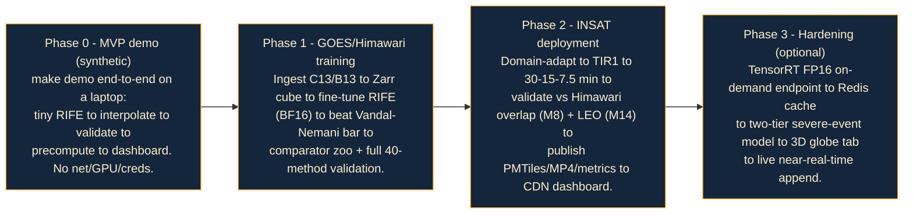

| Phase | Goal | Exit criteria |
|---|---|---|
| **0 — MVP demo (synthetic)** | Prove the architecture end-to-end | `make demo` produces a working dashboard with GT-vs-interp animation + metrics, on a laptop |
| **1 — GOES/Himawari training** | The science core | Fine-tuned RIFE **meets/beats PSNR 45.4 / SSIM 0.933 / RMSE 0.99 K on C13**; comparator ranking table; full 40-method report |
| **2 — INSAT deployment** | PS Deliverable D4 | INSAT 30→15-min animations validated against Himawari overlap (M8) + LEO overpasses (M14); published to CDN |
| **3 — Hardening (optional)** | Production polish | On-demand TensorRT endpoint live; two-tier severe-event routing; near-real-time append |

---

## 14. References

Collated from the six research reports. Each report's own Sources section has the complete list; the highest-leverage citations are below.

### 14.1 Closest prior art & weather/satellite VFI (R1, R6)
- **Vandal & Nemani — *Temporal Interpolation of Geostationary Satellite Imagery with Task-Specific Optical Flow*** (IEEE TNNLS 2021) — **THE quality bar (PSNR 45.4 / SSIM 0.933 / RMSE 0.99 K, Band 13)**. arXiv: https://arxiv.org/abs/1907.12013 · IEEE: https://ieeexplore.ieee.org/document/9511282/ · NTRS: https://ntrs.nasa.gov/citations/20210020625
- Optical Flow for Intermediate Frame Interpolation of Multispectral Geostationary Satellite Data (NTRS): https://ntrs.nasa.gov/citations/20190033878
- Deterministic nowcasting of geostationary IR brightness temperature with 3D U-Net diffusion (Sci. Reports 2026): https://www.nature.com/articles/s41598-025-34207-9
- Learning Robust Precipitation Forecaster by Temporal Frame Interpolation: https://arxiv.org/pdf/2311.18341

### 14.2 VFI models & optical-flow backbones (R1)
- AceVFI survey (2025): https://arxiv.org/pdf/2506.01061 · VFI rankings: https://github.com/AIVFI/Video-Frame-Interpolation-Rankings-and-Video-Deblurring-Rankings
- **RIFE**: https://arxiv.org/abs/2011.06294 · ECCV2022-RIFE (MIT): https://github.com/hzwer/ECCV2022-RIFE · **Practical-RIFE** (MIT): https://github.com/hzwer/Practical-RIFE
- IFRNet (CVPR'22, MIT): https://github.com/ltkong218/IFRNet · https://arxiv.org/pdf/2205.14620
- EMA-VFI (CVPR'23, Apache-2.0): https://github.com/MCG-NJU/EMA-VFI · https://arxiv.org/pdf/2303.00440
- GIMM-VFI (NeurIPS'24): https://github.com/GSeanCDAT/GIMM-VFI · https://arxiv.org/html/2407.08680v4
- FILM (ECCV'22, Apache-2.0): https://github.com/google-research/frame-interpolation · https://arxiv.org/pdf/2202.04901
- Super SloMo (CVPR'18): https://arxiv.org/pdf/1712.00080 · VFIMamba: https://arxiv.org/abs/2407.02315 · BiM-VFI (CVPR'25): https://arxiv.org/abs/2412.11365 · MoMo (AAAI'25): https://arxiv.org/abs/2406.17256
- RAFT-family: SEA-RAFT (ECCV'24): https://github.com/princeton-vl/SEA-RAFT · GMFlow: https://arxiv.org/pdf/2111.13680 · NeuFlow v2: https://arxiv.org/pdf/2408.10161

### 14.3 Satellite datasets & access (R2)
- NOAA GOES on AWS: https://registry.opendata.aws/noaa-goes/ · goes2go: https://github.com/blaylockbk/goes2go · GEE GOES-19 MCMIPF: https://developers.google.com/earth-engine/datasets/catalog/NOAA_GOES_19_MCMIPF
- Himawari on AWS: https://registry.opendata.aws/noaa-himawari/ · JAXA P-Tree: https://www.eorc.jaxa.jp/ptree/
- **MOSDAC** (INSAT-3DS/3DR): https://www.mosdac.gov.in · API manual: https://www.mosdac.gov.in/user-manual-mosdac-data-download-api · products: https://www.mosdac.gov.in/docs/INSAT3D_Products.pdf
- INSAT-3DS L1C on EUMETSAT: https://user.eumetsat.int/catalogue/EO:EUM:DAT:INSAT:INSAT3D-L1C · eumdac guide: https://user.eumetsat.int/resources/user-guides/data-store-detailed-guide
- GK-2A on AWS: https://registry.opendata.aws/noaa-gk2a-pds/ · FengYun NSMC: https://data.nsmc.org.cn · GMGSI: https://registry.opendata.aws/noaa-gmgsi/
- MODIS/VIIRS (LAADS): https://ladsweb.modaps.eosdis.nasa.gov · Sentinel-3 SLSTR (MS PC): https://planetarycomputer.microsoft.com/dataset/sentinel-3-slstr-lst-l2-netcdf · GSICS GEO-LEO IR: https://www.data.jma.go.jp/mscweb/data/monitoring/gsics/ir/techinfo_geoleoir.html

### 14.4 Data engineering / cloud-optimized formats (R3)
- Zarr v3 core spec: https://zarr-specs.readthedocs.io/en/latest/v3/core/index.html · sharding codec: https://zarr-specs.readthedocs.io/en/latest/v3/codecs/sharding-indexed/index.html · performance: https://zarr.readthedocs.io/en/latest/user-guide/performance/
- VirtualiZarr: https://virtualizarr.readthedocs.io/en/latest/ · kerchunk: https://fsspec.github.io/kerchunk/ · Icechunk 1.0: https://www.earthmover.io/blog/icechunk-1-0-production-grade-cloud-native-array-storage-is-here/ · repo: https://github.com/earth-mover/icechunk
- satpy resampling (cached KDTree): https://satpy.readthedocs.io/en/stable/resample.html · pyresample: https://github.com/pytroll/pyresample
- TensorStore: https://google.github.io/tensorstore/ · kvikIO Zarr: https://docs.rapids.ai/api/kvikio/stable/zarr/ · NVIDIA DALI: https://github.com/NVIDIA/DALI · FFCV: https://github.com/libffcv/ffcv/
- COG in-depth: https://cogeo.org/in-depth.html · Cache-Control immutable: https://www.keycdn.com/blog/cache-control-immutable

### 14.5 Web visualization (R4)
- deck.gl: https://deck.gl/docs/api-reference/layers/bitmap-layer · https://deck.gl/docs/developer-guide/animations-and-transitions · MapLibre GL JS: https://maplibre.org/projects/gl-js/
- PMTiles: https://docs.protomaps.com/pmtiles/ · cloud storage/CORS: https://docs.protomaps.com/pmtiles/cloud-storage · rio-pmtiles: https://pypi.org/project/rio-pmtiles/ · maplibre-gl-compare: https://github.com/maplibre/maplibre-gl-compare
- WebCodecs: https://developer.chrome.com/docs/web-platform/best-practices/webcodecs · uPlot: https://github.com/leeoniya/uPlot · Cloudflare Pages/R2: https://docs.protomaps.com/deploy/cloudflare

### 14.6 Validation & metrics (R5)
- Visual Quality Assessment for VFI (pixel metrics insufficient): https://arxiv.org/pdf/1901.05362 · efficient motion-based VFI metrics: https://arxiv.org/pdf/2508.09078
- Nowcasting verification survey (FSS/CSI/CRPS): https://arxiv.org/pdf/2406.04867 · DGMR pooled-CRPS: https://arxiv.org/pdf/2104.00954 · SAL (Wernli/AMS): https://journals.ametsoc.org/view/journals/wefo/33/4/waf-d-17-0162_1.xml
- Triple collocation (Loew 2017): https://agupubs.onlinelibrary.wiley.com/doi/full/10.1002/2017RG000562 · non-ideal TC: https://doi.org/10.3390/rs17223751
- INSAT-3D CTT validation (bias −0.31 K, RMSE 10.30 K): https://www.mdpi.com/2072-4292/11/23/2811 · GSICS ABI–AHI ~0.3 K: https://www.data.jma.go.jp/mscweb/data/monitoring/gsics/ir/techinfo_geoleoir.html
- Libraries: piq https://piq.readthedocs.io · sewar https://pypi.org/project/sewar/ · torchmetrics https://lightning.ai/docs/torchmetrics/ · pysteps (verification) · xskillscore · tobac

### 14.7 Training, inference & serving (R6)
- IFRNet full text (losses, 300-ep recipe): https://ar5iv.labs.arxiv.org/html/2205.14620 · FILM Gram/style loss: https://film-net.github.io/
- INT8 VFI degradation (ANVIL, −0.9…−4.4 dB): https://arxiv.org/pdf/2603.26835 · Torch-TensorRT up-to-6×: https://developer.nvidia.com/blog/accelerating-inference-up-to-6x-faster-in-pytorch-with-torch-tensorrt/
- grid_sample ONNX opset16: https://github.com/onnx/onnx/discussions/5825 · TensorRT GridSample: https://github.com/NVIDIA/TensorRT/issues/3400 · Triton model config: https://github.com/triton-inference-server/server/blob/main/docs/user_guide/model_configuration.md
- FFCV (CVPR'23): https://openaccess.thecvf.com/content/CVPR2023/papers/Leclerc_FFCV_Accelerating_Training_by_Removing_Data_Bottlenecks_CVPR_2023_paper.pdf · PyTorch AMP: https://docs.pytorch.org/tutorials/recipes/recipes/amp_recipe.html · FSDP: https://pytorch.org/blog/efficient-large-scale-training-with-pytorch/ · serverless GPU 2025: https://introl.com/blog/serverless-gpu-platforms-runpod-modal-beam-comparison-guide-2025

---

*FrameFlow — ISRO BAH 2026 PS-12 · Architecture v1.0 · 2026-06-20. Every decision herein is grounded in [`research/`](research/) and [`idea.md`](idea.md). This document is the contract between the team's intent and its implementation, and the map the judges will use to evaluate FrameFlow.*
